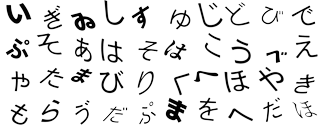
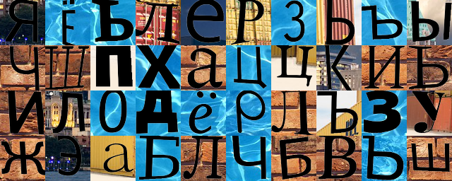

# OmniPrint 


A synthetic data generator of isolated printed characters. 

## Platform

- Linux or macOS
- Windows not tested, but should also work 
- Python 3 (tested with Python 3.6.1)


## Installation

- Clone this repo:
```zsh
git clone https://github.com/SunHaozhe/OmniPrint
cd OmniPrint
```

- It is preferable to install this project within a Python virtual environment.

```zsh
virtualenv venv_omniprint 
source venv_omniprint/bin/activate
```

- Install requirements

```zsh
pip3 install --upgrade pip 
pip3 install -r requirements.txt
```


## Getting Started

We do not provide fonts (the directory `omniprint/fonts/`) along with this project, users have to run the font preparation program (under the directory `omniprint/prepare_fonts/`) themselves before being able to run any experiments. By running the font preparation program, the directory `omniprint/prepare_fonts/fonts/` will be generated, move it to `omniprint/fonts/`. The font preparation program does not only download the font files, it also generates some metadata which is necessary for this project. Please check [omniprint/prepare_fonts/README.md](omniprint/prepare_fonts/README.md) for more details. 

Fonts are usually protected under their own licenses. Some fonts cannot be redistributed or modified, which is the reason why we do not provide the directory `omniprint/fonts/` here. We do not provide any warranty for the fonts. 

The entry point of **OmniPrint** is the script `omniprint/run.py`, the simplest example would be `python3 run.py –count 10`. A lot of options can be passed to `run.py` (see `python3 run.py --help`). In order to avoid the overhead of writing these options every time, we provide a helper script called `omniprint/quick_run.py`. Users can edit all the options in `omniprint/quick_run.py`, then simply run `python3 quick_run.p`.


Go to the main directory: 

```zsh
cd omniprint
```

Run the font preparation program:

```zsh
# go to the font preparation directory 
cd prepare_fonts

# The font preparation program 
## On linux/MacOS system, the following two lines 
## can be replaced by ./pipeline.sh
python3 download_fonts.py
python3 build_font_directory.py -d ../alphabets/fine 

# move omniprint/prepare_fonts/fonts/ to omniprint/fonts/
mv fonts ../fonts

# go back to the main directory 
cd ../
```

Edit the class `Parameters` in `quick_run.py` to set up different command line options, then run:

```zsh
python3 quick_run.py  
```

Alternatively, specify the command line options directly using the command line interface. Here are some examples: 

```zsh
# generate 10 images using default options
python3 run.py --count 10

# generate 1000 images with height 64
python3 run.py --count 1000 --size 64

# generate 1000 images with height and width 32
python3 run.py --count 1000 --size 32 --ensure_square_layout

# generate 1000 images with height and width 32, 
# all characters are rotated by 5.4 degrees clockwise. 
python3 run.py --count 1000 --size 32 --ensure_square_layout --rotation -5.4

# generate 1000 images with height and width 32, 
# characters are randomly rotated within [-30, 30] degrees. 
python3 run.py --count 1000 --size 32 --ensure_square_layout --rotation 30 --random_rotation

# generate 1000 images with height and width 32, 
# characters are randomly rotated within [-30, 30] degrees, 
# they are also randomly sheared within [-0.5, 0.5].
python3 run.py --count 1000 --size 32 --ensure_square_layout --rotation 30 --random_rotation --shear_x 0.5 --random_shear_x 

# generate 10 images with height and width 32, 
# each character is centered with added margins, 
# the added margins are 10% of the height/width 
# for top, left, bottom and right. 
python3 run.py --count 10 --size 32 --ensure_square_layout --margins 0.1,0.1,0.1,0.1

# generate 10 images with height and width 32, 
# the character roughly occupies 64% of the space 
# in the image. The position of the character is 
# random within the image while ensuring the 
# character remains complete (random translation 
# in both directions). 
python3 run.py --count 10 --size 32 --ensure_square_layout --margins 0.1,0.1,0.1,0.1 --random_translation_x --random_translation_y 

# generate grayscale images
python3 run.py --count 10 --size 32 --ensure_square_layout --image_mode L 

# generate binary images
python3 run.py --count 10 --size 32 --ensure_square_layout --image_mode 1

# text is filled with red color (foreground) 
python3 run.py --count 10 --size 32 --ensure_square_layout --stroke_fill 255,0,0

# text is filled with a random RGB color (foreground)
python3 run.py --count 10 --size 32 --ensure_square_layout --random_stroke_fill

# text with random Gaussian blurring 
# (after resizing/downsampling)
python3 run.py --count 10 --size 32 --ensure_square_layout --blur 2 --random_blur 

# text with Gaussian noise background 
python3 run.py --count 10 --size 32 --ensure_square_layout --background 0

# text with plain white background 
python3 run.py --count 10 --size 32 --ensure_square_layout --background 1

# text with image background, the background is 
# randomly cropped from some external images 
python3 run.py --count 10 --size 32 --ensure_square_layout --background 3

# text in other scripts/languages
python3 run.py --count 10 --size 32 --ensure_square_layout --dict alphabets/fine/chinese_group1 

python3 run.py --count 10 --size 32 --ensure_square_layout --dict alphabets/fine/hebrew

python3 run.py --count 10 --size 32 --ensure_square_layout --dict alphabets/fine/khmer_consonants

python3 run.py --count 10 --size 32 --ensure_square_layout --dict alphabets/fine/mongolian_digits 

# variable font weight (stroke width). 
## Make sure that the used fonts all support 
## customizable font weight. Font index files 
## with names variable_weight_* contain these 
## kind of fonts. 
python3 run.py --count 10 --size 32 --ensure_square_layout --dict alphabets/fine/basic_latin_uppercase --font_index fonts/variable_weight_basic_latin_uppercase --random_font_weight

# morphological image processing - erosion
## with kernel size 3, number of iterations 2 and 
## elliptical kernel
python3 run.py --count 10 --size 32 --ensure_square_layout --morph_erosion 3,2,ellipse

# morphological image processing - erosion
## with kernel size 3, number of iterations 2 and 
## elliptical kernel
python3 run.py --count 10 --size 32 --ensure_square_layout --morph_erosion 3,2,ellipse

# apply a random morphological erosion operation 
python3 run.py --count 10 --size 32 --ensure_square_layout --random_morph_erosion
```

To understand the command line options: 

```zsh
python3 run.py --help
```

```
usage: run.py [-h] [--output_dir [OUTPUT_DIR]] [-c [COUNT]] [-s [SIZE]]
              [-p [NB_PROCESSES]] [-e [EXTENSION]] [-bl [BLUR]] [-rbl]
              [-b [BACKGROUND]] [-om] [-m [MARGINS]] [-ft [FONT]]
              [-fd [FONT_DIR]] [-fidx [FONT_INDEX]] [-id [IMAGE_DIR]]
              [-dt [DICT]] [-fwt [FONT_WEIGHT]] [-rfwt] [-stf [STROKE_FILL]]
              [-rstf] [-im [IMAGE_MODE]] [-rsd RANDOM_SEED] [-esl]
              [-otlwd OUTLINE_WIDTH] [-fsz FONT_SIZE] [-lt [LINEAR_TRANSFORM]]
              [-rtn [ROTATION]] [-rrtn] [-shrx [SHEAR_X]] [-rshrx]
              [-shry [SHEAR_Y]] [-rshry] [-sclx [SCALE_X]] [-rsclx]
              [-scly [SCALE_Y]] [-rscly] [-alpha [ALPHA]] [-ralpha]
              [-beta [BETA]] [-rbeta] [-gamma [GAMMA]] [-rgamma]
              [-delta [DELTA]] [-rdelta] [-rtslnx] [-rtslny]
              [-pt [PERSPECTIVE_TRANSFORM]]
              [-rpt [RANDOM_PERSPECTIVE_TRANSFORM]]
              [-gpr GAUSSIAN_PRIOR_RESIZING] [-morphero MORPH_EROSION]
              [-rmorphero] [-morphdil MORPH_DILATION] [-rmorphdil]
              [-morphope MORHP_OPENING] [-rmorphope] [-morphclo MORHP_CLOSING]
              [-rmorphclo] [-morphgra MORHP_GRADIENT] [-rmorphgra]
              [-morphtoph MORHP_TOPHAT] [-rmorphtoph]
              [-morphblah MORHP_BLACKHAT] [-rmorphblah]

Generate synthetic text data for text recognition.

optional arguments:
  -h, --help            show this help message and exit
  --output_dir [OUTPUT_DIR]
                        The output directory
  -c [COUNT], --count [COUNT]
                        The number of images to be created.
  -s [SIZE], --size [SIZE]
                        Define the height of the produced images. If the
                        option --ensure_square_layout is activated, then this
                        will also be the width of the produced images,
                        otherwise the width will be determined by both the
                        length of the text and the height.
  -p [NB_PROCESSES], --nb_processes [NB_PROCESSES]
                        Define the number of processes to use for image
                        generation. If not provided, this equals to the number
                        of CPU cores
  -e [EXTENSION], --extension [EXTENSION]
                        Define the extension to save the image with
  -bl [BLUR], --blur [BLUR]
                        Apply gaussian blur to the resulting sample. Should be
                        an integer defining the blur radius, 0 by default.
  -rbl, --random_blur   When set, the blur radius will be randomized between 0
                        and -bl.
  -b [BACKGROUND], --background [BACKGROUND]
                        Define what kind of background to use. 0: Gaussian
                        Noise, 1: Plain white, 2: Quasicrystal, 3: Image
  -om, --output_mask    Define if the generator will return masks for the text
  -m [MARGINS], --margins [MARGINS]
                        Define the margins (percentage) around the text when
                        rendered. Each element (top, left, bottom and right)
                        should be a float
  -ft [FONT], --font [FONT]
                        Define font to be used
  -fd [FONT_DIR], --font_dir [FONT_DIR]
                        Define a font directory to be used
  -fidx [FONT_INDEX], --font_index [FONT_INDEX]
                        Define the font index file to be used, an example is
                        fonts/latin.txt
  -id [IMAGE_DIR], --image_dir [IMAGE_DIR]
                        Define an image directory to use when background is
                        set to image
  -dt [DICT], --dict [DICT]
                        Define the dictionary to be used
  -fwt [FONT_WEIGHT], --font_weight [FONT_WEIGHT]
                        Define the width of the strokes
  -rfwt, --random_font_weight
                        Use random font weight (stroke width).
  -stf [STROKE_FILL], --stroke_fill [STROKE_FILL]
                        Define the color of the strokes
  -rstf, --random_stroke_fill
                        Use random color to fill strokes.
  -im [IMAGE_MODE], --image_mode [IMAGE_MODE]
                        Define the image mode to be used. RGB is default, L
                        means 8-bit grayscale images, 1 means 1-bit binary
                        images stored with one pixel per byte, etc.
  -rsd RANDOM_SEED, --random_seed RANDOM_SEED
                        Random seed
  -esl, --ensure_square_layout
                        Whether the width should be the same as the height
  -otlwd OUTLINE_WIDTH, --outline_width OUTLINE_WIDTH
                        Width of stroke outline. Not yet implemented
  -fsz FONT_SIZE, --font_size FONT_SIZE
                        Font size in point
  -lt [LINEAR_TRANSFORM], --linear_transform [LINEAR_TRANSFORM]
                        The parameter for linear transform. The length must be
                        4, 5 or 9. Length 4 corresponds low level
                        parameterization, which means a, b, d, e, this is the
                        most customizable parameterization. Length 5 and
                        length 9 correspond to high level parameterization.
                        Length 5 means rotation, shear_x, shear_y, scale_x,
                        scale_y. Length 9 means rotation, shear_x, shear_y,
                        scale_x, scale_y, alpha_, beta_, gamma_, delta_. If
                        this parameter is set, other linear transform
                        parameters like rotation, shear_x, etc. will be
                        ignored
  -rtn [ROTATION], --rotation [ROTATION]
                        Define rotation angle (in degree) of the generated
                        text. Used only when --linear_transform is not set
  -rrtn, --random_rotation
                        Uniformly sample the value of rotation, the parameter
                        --rotation needs to be set. The range is
                        [-abs(rotation), abs(rotation)]
  -shrx [SHEAR_X], --shear_x [SHEAR_X]
                        High level linear transform parameter, horizontal
                        shear. Used only when --linear_transform is not set
  -rshrx, --random_shear_x
                        Uniformly sample the value of shear_x, the parameter
                        --shear_x needs to be set. The range is
                        [-abs(shear_x), abs(shear_x)]
  -shry [SHEAR_Y], --shear_y [SHEAR_Y]
                        High level linear transform parameter, vertical shear.
                        Used only when --linear_transform is not set
  -rshry, --random_shear_y
                        Uniformly sample the value of shear_y, the parameter
                        --shear_y needs to be set. The range is
                        [-abs(shear_y), abs(shear_y)]
  -sclx [SCALE_X], --scale_x [SCALE_X]
                        High level linear transform parameter, horizontal
                        scale. Used only when --linear_transform is not set
  -rsclx, --random_scale_x
                        Uniformly sample the value of scale_x, the parameter
                        --scale_x needs to be set. The range is
                        [-abs(scale_x), abs(scale_x)]
  -scly [SCALE_Y], --scale_y [SCALE_Y]
                        High level linear transform parameter, vertical scale.
                        Used only when --linear_transform is not set
  -rscly, --random_scale_y
                        Uniformly sample the value of scale_y, the parameter
                        --scale_y needs to be set. The range is
                        [-abs(scale_y), abs(scale_y)]
  -alpha [ALPHA], --alpha [ALPHA]
                        Customizable high level linear transform parameter,
                        top left element in the 2x2 matrix. Used only when
                        --linear_transform is not set
  -ralpha, --random_alpha
                        Uniformly sample the value of alpha, the parameter
                        --alpha needs to be set. The range is [-abs(alpha),
                        abs(alpha)]
  -beta [BETA], --beta [BETA]
                        Customizable high level linear transform parameter,
                        top right element in the 2x2 matrix. Used only when
                        --linear_transform is not set
  -rbeta, --random_beta
                        Uniformly sample the value of beta, the parameter
                        --beta needs to be set. The range is [-abs(beta),
                        abs(beta)]
  -gamma [GAMMA], --gamma [GAMMA]
                        Customizable high level linear transform parameter,
                        bottom left element in the 2x2 matrix. Used only when
                        --linear_transform is not set
  -rgamma, --random_gamma
                        Uniformly sample the value of gamma, the parameter
                        --gamma needs to be set. The range is [-abs(gamma),
                        abs(gamma)]
  -delta [DELTA], --delta [DELTA]
                        Customizable high level linear transform parameter,
                        bottom right element in the 2x2 matrix. Used only when
                        --linear_transform is not set
  -rdelta, --random_delta
                        Uniformly sample the value of delta, the parameter
                        --delta needs to be set. The range is [-abs(delta),
                        abs(delta)]
  -rtslnx, --random_translation_x
                        Uniformly sample the value of horizontal translation.
                        This will have no effect if horizontal margins are 0
  -rtslny, --random_translation_y
                        Uniformly sample the value of vertical translation.
                        This will have no effect if vertical margins are 0
  -pt [PERSPECTIVE_TRANSFORM], --perspective_transform [PERSPECTIVE_TRANSFORM]
                        Apply a perspective transformation. Given the
                        coordinates of the four corners of the first
                        quadrilateral and the coordinates of the four corners
                        of the second quadrilateral, perform the perspective
                        transform that maps a new point in the first
                        quadrilateral onto the appropriate position on the
                        second quadrilateral. Perspective transformation
                        simulates different angle of view. Enter 8 real
                        numbers (float) which correspond to the 4 corner
                        points (2D coordinates) of the target quadrilateral,
                        these 4 corner points which be respectively mapped to
                        [[0, 0], [1, 0], [0, 1], [1, 1]] in the source
                        quadrilateral. [0, 0] is the top left corner, [1, 0]
                        is the top left corner, [0, 1] is the bottom left
                        corner, [1, 1] is the bottom right corner.These
                        coordinates have been normalized to unit square [0,
                        1]^2. Thus, the entered corner points should match the
                        order of magnitude and must be convex. For example,
                        0,0,1,0,0,1,1,1 will produce identity transform. This
                        option will have no effect if
                        --random_perspective_transform is set. This option
                        should never be used together with added margins.
  -rpt [RANDOM_PERSPECTIVE_TRANSFORM], --random_perspective_transform [RANDOM_PERSPECTIVE_TRANSFORM]
                        Randomly use a perspective transformation. Randomly
                        generate a convex quadrilateral which will be mapped
                        to the normalized unit square, the value of each axis
                        is independently sampled from the gaussian
                        distribution, the standard deviation of the gaussian
                        distribution is given by
                        --random_perspective_transform. If this option is
                        present but not followed by a command-line argument,
                        the standard deviation 0.05 will be used by default.
                        This option should never be used together with added
                        margins.
  -gpr GAUSSIAN_PRIOR_RESIZING, --gaussian_prior_resizing GAUSSIAN_PRIOR_RESIZING
                        If not None, apply Gaussian filter to smooth image
                        prior to resizing, the argument of this parameter
                        needs to be a float, which will be used as the
                        standard deviation of Gaussian filter. Default is
                        None, which means Gaussian filter is not used before
                        resizing.
  -morphero MORPH_EROSION, --morph_erosion MORPH_EROSION
                        Morphological image processing - erosion. The argument
                        must be a tuple separated by comma without space, the
                        first element is the kernel size, the second element
                        is the number of iterations. For example, 3,2 means
                        kernel_size=3x3, iterations=2. 3,2,ellipse (3,2,cross)
                        means using elliptical (cross-shaped) kernel
                        respectively. If the third argument is not given, the
                        default kernel shape will be rectangle.
  -rmorphero, --random_morph_erosion
                        Uniformly sample the value of morphological erosion,
                        the parameter --morph_erosion needs to be set. The
                        range is [1, kernel_size] ([1, iterations])
                        kernel_shape is randomly chosen among [rectangle,
                        ellipse, cross].
  -morphdil MORPH_DILATION, --morph_dilation MORPH_DILATION
                        Morphological image processing - dilation. The
                        argument must be a tuple separated by comma without
                        space, the first element is the kernel size, the
                        second element is the number of iterations. For
                        example, 3,2 means kernel_size=3x3, iterations=2.
                        3,2,ellipse (3,2,cross) means using elliptical (cross-
                        shaped) kernel respectively. If the third argument is
                        not given, the default kernel shape will be rectangle.
  -rmorphdil, --random_morph_dilation
                        Uniformly sample the value of morphological dilation,
                        the parameter --morph_dilation needs to be set. The
                        range is [1, kernel_size] ([1, iterations])
                        kernel_shape is randomly chosen among [rectangle,
                        ellipse, cross].
  -morphope MORHP_OPENING, --morhp_opening MORHP_OPENING
                        Morphological image processing - opening. The argument
                        must be a tuple separated by comma without space, the
                        first element is the kernel size, the second element
                        is the kernel shape. For example, 3 means
                        kernel_size=3x3. 3,ellipse (3,cross) means using
                        elliptical (cross-shaped) kernel respectively. If the
                        second argument is not given, the default kernel shape
                        will be rectangle.
  -rmorphope, --random_morph_opening
                        Uniformly sample the value of morphological opening,
                        the parameter --morph_opening needs to be set. The
                        range is [1, kernel_size] kernel_shape is randomly
                        chosen among [rectangle, ellipse, cross].
  -morphclo MORHP_CLOSING, --morhp_closing MORHP_CLOSING
                        Morphological image processing - closing. The argument
                        must be a tuple separated by comma without space, the
                        first element is the kernel size, the second element
                        is the kernel shape. For example, 3 means
                        kernel_size=3x3. 3,ellipse (3,cross) means using
                        elliptical (cross-shaped) kernel respectively. If the
                        second argument is not given, the default kernel shape
                        will be rectangle.
  -rmorphclo, --random_morph_closing
                        Uniformly sample the value of morphological closing,
                        the parameter --morph_closing needs to be set. The
                        range is [1, kernel_size] kernel_shape is randomly
                        chosen among [rectangle, ellipse, cross].
  -morphgra MORHP_GRADIENT, --morhp_gradient MORHP_GRADIENT
                        Morphological image processing - gradient. The
                        argument must be a tuple separated by comma without
                        space, the first element is the kernel size, the
                        second element is the kernel shape. For example, 3
                        means kernel_size=3x3. 3,ellipse (3,cross) means using
                        elliptical (cross-shaped) kernel respectively. If the
                        second argument is not given, the default kernel shape
                        will be rectangle.
  -rmorphgra, --random_morph_gradient
                        Uniformly sample the value of morphological gradient,
                        the parameter --morph_gradient needs to be set. The
                        range is [1, kernel_size] kernel_shape is randomly
                        chosen among [rectangle, ellipse, cross].
  -morphtoph MORHP_TOPHAT, --morhp_tophat MORHP_TOPHAT
                        Morphological image processing - Top Hat. The argument
                        must be a tuple separated by comma without space, the
                        first element is the kernel size, the second element
                        is the kernel shape. For example, 3 means
                        kernel_size=3x3. 3,ellipse (3,cross) means using
                        elliptical (cross-shaped) kernel respectively. If the
                        second argument is not given, the default kernel shape
                        will be rectangle.
  -rmorphtoph, --random_morph_tophat
                        Uniformly sample the value of morphological tophat,
                        the parameter --morph_tophat needs to be set. The
                        range is [1, kernel_size] kernel_shape is randomly
                        chosen among [rectangle, ellipse, cross].
  -morphblah MORHP_BLACKHAT, --morhp_blackhat MORHP_BLACKHAT
                        Morphological image processing - Black Hat. The
                        argument must be a tuple separated by comma without
                        space, the first element is the kernel size, the
                        second element is the kernel shape. For example, 3
                        means kernel_size=3x3. 3,ellipse (3,cross) means using
                        elliptical (cross-shaped) kernel respectively. If the
                        second argument is not given, the default kernel shape
                        will be rectangle.
  -rmorphblah, --random_morph_blackhat
                        Uniformly sample the value of morphological blackhat,
                        the parameter --morph_blackhat needs to be set. The
                        range is [1, kernel_size] kernel_shape is randomly
                        chosen among [rectangle, ellipse, cross].
```


## Examples

### Example 1



In this first example, every image is grayscale and contains a single character randomly selected from Hiragana script (Japanese). The size of each image is 32x32. Every character is rotated by a random degree uniformly sampled from the range [−30,30], composed by a random horizontal shear uniformly sampled from the range [−0.5, 0.5]. Each character occupies about 64% of the area of the image. The random translation option along both horizontal and vertical axes is activated, which means that each foreground text was pasted at a random position within its background image. We used plain whiteboard as the background for this dataset. The standard deviation of the Gaussian filter prior to downsampling is 2.

To reproduce this example using `omniprint/quick_run.py`:

- First edit `omniprint/quick_run.py` like this

```python
class Parameters:
    count = 1000
    size = 32 
    ensure_square_layout = True
    image_mode = "L" 
    margins = "0.1,0.1,0.1,0.1"
    background = 1 
    dict_ = "alphabets/fine/hiragana" 
    random_translation_x = True 
    random_translation_y = True 
    gaussian_prior_resizing = 2 
    rotation = 30
    random_rotation = True 
    shear_x = 0.5
    random_shear_x = True 
```

- Then run `python3 quick_run.py` 

Equivalently, run:

```zsh
python3 run.py --count 1000 --size 32 --ensure_square_layout --image_mode L --margins 0.1,0.1,0.1,0.1 --background 1 --dict alphabets/fine/hiragana --random_translation_x --random_translation_y --gaussian_prior_resizing 2 --rotation 30 --random_rotation --shear_x 0.5 --random_shear_x 
```


### Example 2



In the second example, characters are chosen from Russian alphabet. Each image is RGB and resized to 64x64. No margins are added. A random perspective transform is applied to each image (foreground text layer). The background is randomly cropped from some external images.

To reproduce this example using `omniprint/quick_run.py`:

- First edit `omniprint/quick_run.py` like this

```python
class Parameters:
    count = 1000
    size = 64 
    ensure_square_layout = True
    image_mode = "RGB" 
    background = 3 
    dict_ = "alphabets/fine/russian" 
    random_perspective_transform = 0.05
```

- Then run `python3 quick_run.py` 

Equivalently, run:

```zsh
python3 run.py --count 1000 --size 64 --ensure_square_layout --image_mode RGB --background 3 --dict alphabets/fine/russian --random_perspective_transform 0.05
```


## Dataset formats 

### Raw dataset 

By default, the generated raw dataset will be stored under the directory `omniprint/out/`. For example, let's assume that `omniprint/out/20201222_223218_562501/` is one raw dataset generated by one run (`python3 quick_run.py`). The name `20201222_223218_562501` corresponds to the UTC date and time. `omniprint/out/20201222_223218_562501/` contains two subdirectories:

- `omniprint/out/20201222_223218_562501/data/`
- `omniprint/out/20201222_223218_562501/label/`

`omniprint/out/20201222_223218_562501/data/` contains images such as 

- `omniprint/out/20201222_223218_562501/data/20201222_223218_562501_0.png`
- `omniprint/out/20201222_223218_562501/data/20201222_223218_562501_1.png`
- `omniprint/out/20201222_223218_562501/data/20201222_223218_562501_2.png`
- etc. 

`omniprint/out/20201222_223218_562501/label/` contains one single file `raw_labels.csv`. This csv files contains all available labels, its column depends on the used command line options. For example, its column can include: 

- `image_name`
- `text`
- `unicode_code_point`
- `font_file`
- `font_weight`
- `image_height_resolution`
- `image_width_resolution`
- `margin_bottom`
- `rotation`
- `shear_x`
- `family_name` (font)
- `style_name` (font)
- `postscript_name` (font)
- etc. 


Although the raw datasets could be used directly by extracting desired labels from `omniprint/out/20201222_223218_562501/label/raw_labels.csv`, we provide utility programs which turn them into more standard dataset formats like [AutoML format](https://github.com/codalab/chalab/wiki/Help:-Wizard-%E2%80%90-Challenge-%E2%80%90-Data) and [AutoDL File format](https://github.com/zhengying-liu/autodl-contrib/tree/master/file_format). This utility programs are stored under the directory `omniprint/dataset/`. 


### Dataset in AutoML format or AutoDL File format

- [AutoML format](https://github.com/codalab/chalab/wiki/Help:-Wizard-%E2%80%90-Challenge-%E2%80%90-Data) is better for machine to use. Basically, AutoML format stores the whole dataset in the form of a single matrix. Each row of the matrix corresponds to one vectorized image. Consequently, if one wants to use AutoML format, one must ensure that each image is of the same size (at least the same number of pixels * channels). The raw dataset should normally be generated using the command line option `--ensure_square_layout`, otherwise the width of the images may differ. 
- [AutoDL File format](https://github.com/zhengying-liu/autodl-contrib/tree/master/file_format) is better for human to visualize. Basically, AutoDL File format stores the images as they are. This format is similar to the format of the raw datasets. 

The entry point of the dataset formatting program is `omniprint/dataset/run_dataset_formatter.py`. 

```zsh
python3 run_dataset_formatter.py --help
```

```
usage: run_dataset_formatter.py [-h] [-n DATASET_NAME] [-r RAW_DATASET_PATH]
                                [-l LABEL_NAME] [-ir] [-f FORMAT]

optional arguments:
  -h, --help            show this help message and exit
  -n DATASET_NAME, --dataset_name DATASET_NAME
  -r RAW_DATASET_PATH, --raw_dataset_path RAW_DATASET_PATH
  -l LABEL_NAME, --label_name LABEL_NAME
  -ir, --is_regression
  -f FORMAT, --format FORMAT
                        Which data format to use? Options: automl, file.
```

First, go to the dataset formatting directory `omniprint/dataset/`:

```zsh
cd dataset
```

For example, if one wants to turn `omniprint/out/20201222_223218_562501/` into AutoML format and wants to make a multiclass classification dataset of characters/symbols, one can use the column `unicode_code_point` of `omniprint/out/20201222_223218_562501/label/raw_labels.csv`. Unicode code point is the unique ID of each character, each Unicode code point is an integer. 

```zsh
python3 run_dataset_formatter.py --dataset_name make_a_name_as_you_like --raw_dataset_path ../out/20201222_223218_562501 --label_name unicode_code_point --format automl
```

Instead of AutoML format, if one wants to make the same dataset in AutoDL File format.

```zsh
python3 run_dataset_formatter.py --dataset_name make_a_name_as_you_like --raw_dataset_path ../out/20201222_223218_562501 --label_name unicode_code_point --format file
```

If one wants to make a regression dataset from `omniprint/out/20201222_223218_562501/` in AutoML format and wants to predict the rotation of characters/symbols, one can use the column `rotation` (`float`) of `omniprint/out/20201222_223218_562501/label/raw_labels.csv`.

```zsh
python3 run_dataset_formatter.py --dataset_name make_a_name_as_you_like --raw_dataset_path ../out/20201222_223218_562501 --label_name unicode_code_point --format automl --is_regression
```

If one wants to make a regression dataset from `omniprint/out/20201222_223218_562501/` in AutoDL File format and wants to predict the horizontal shear of characters/symbols, one can use the column `shear_x` (`float`) of `omniprint/out/20201222_223218_562501/label/raw_labels.csv`.

```zsh
python3 run_dataset_formatter.py --dataset_name make_a_name_as_you_like --raw_dataset_path ../out/20201222_223218_562501 --label_name shear_x --format file --is_regression
```

The formatted datasets (AutoML format or AutoDL File format) are stored under the directory `omniprint/dataset/datasets/`.


## Extensibility

**OmniPrint** is easily extensible. 

### Adding new languages/scripts/alphabets 

Importing new alphabets is easy in **OmniPrint**. For example, if one wants to add an alphabet called `esperanto`. 

- Create a text file called `esperanto.txt` under the directory `omniprint/alphabets/`
- In `omniprint/alphabets/esperanto.txt`, insert alphabet/character/symbol of this language/script, one item per line. This file should not contain empty lines. 
- Don't forget to make a font index file for this newly added alphabet, for example `omniprint/fonts/index/esperanto.txt`. Insert names (including suffix like `.ttf` or `.otf`) of the font files (among font files under `omniprint/fonts/fonts/`) that fully support `omniprint/alphabets/esperanto.txt`.
- Optionally, make `omniprint/fonts/index/variable_weight_esperanto.txt` to allow font weight (stroke width) variation.


### Adding new fonts

Importing new fonts is easy in **OmniPrint**. 

- Move new fonts to the directory `omniprint/fonts/fonts/`
- Optionally, update the index file under the directory `omniprint/fonts/index/` if users want to randomly select fonts
- Optionally, update the metadata of fonts under the directory `omniprint/fonts/metadata/`
- Users should not forget to include license files in the directory `omniprint/fonts/licenses/`

Please be aware that some fonts can produce false rendering without reporting warnings or errors, users import new fonts at their own risk. 

### Adding new transformations

New post-rasterization transformations can be easily added to the image generation pipeline. For example, if one wants to add a transformation called `my_transform`.

- Create a Python script called `my_transform.py` under the directory `omniprint/transforms/`
- Implement the desired functionalities in `omniprint/transforms/my_transform.py`, which contains a function called `transform`. The first two positional parameters of the function `transform` should be the image and its corresponding mask. (Used for masking foreground text layer such that only the text itself will be pasted onto the background.) The image is a RGB `PIL.Image.Image` object (The image will be converted to grayscale image or binary image in the end, if needed.) where text is black (`0`) and background is white (`255`). The mask is a grayscale `PIL.Image.Image` object where text is white (`255`) and background is black (`0`). In principle, the mask should undergo the same operations as the image while taking into account the difference in image mode and black/white convention. The function `transform` can, of course, accept other parameters, which is usually the case. The output of the function `transform` is a `tuple` of size 2: the first is the transformed image, the second is the transformed mask. 
- Edit the script `omniprint/transforms/__init__.py`, add one line: `from transforms.my_transform import transform as my_transform`
- Edit the script `omniprint/data_generator.py` to insert the implemented transform at appropriate location. For example, `img, mask = my_transform(img, mask)`
- It is recommended to edit the argument parsing function of the entry script `omniprint/run.py`, which allows specifying parameters of the newly implemented transformation via command line options. It is also recommended to wrap `img, mask = my_transform(img, mask)` in `omniprint/data_generator.py` by something like `if args.get(my_transform) is not None:`, which allows to activate and deactivate the newly implemented transformation.


## Speed benchmarks

Number of images generated per second.

Test command: 
```python
python3 run.py --count 1000 --size 32 --ensure_square_layout --image_mode L --dict alphabets/fine/basic_latin_lowercase
```

- 2.7 GHz Dual-Core Intel Core i5 + SSD 
    - `--nb_processes 1`   123 images per second 
    - `--nb_processes 2`   197 images per second
    - `--nb_processes 4`   226 images per second
    - `--nb_processes 8`   174 images per second
    - `--nb_processes 16` 130 images per second 
    - `--nb_processes 32` 94 images per second


## Legacy code

The following files or directories are legacy code that are not updated yet, they are not used at this stage. 

- `codecov.yml`
- `tests.py`
- `tests/`
- `omniprint/generators/`

## Feature request & issues

Despite our effort, it may still be possible to observe incorrectly rendered images unfortunately due to corrupted font files. If you do observe this kind of error, please open an issue and provide the raw label csv file `omniprint/out/xxx/label/raw_labels.csv` of that raw dataset. We will then identify the problematic font file and filter it out. 

If anything is missing, unclear, or simply not working, open an issue on the repository.

## Acknowledgement

This project was a fork of [TextRecognitionDataGenerator](https://github.com/Belval/TextRecognitionDataGenerator). We would like to warmly thank all the contributors of this open source software, especially Edouard Belval. 


