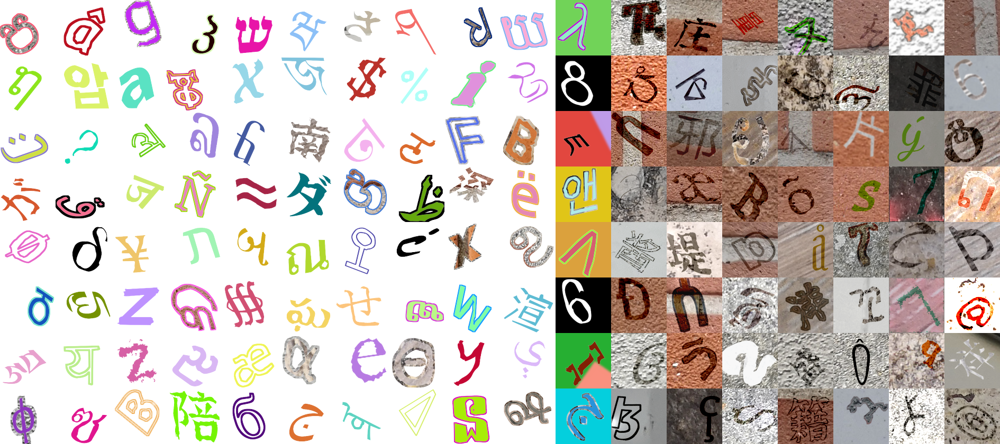

# OmniPrint 





## Platform

- Linux or macOS
- Windows not tested, but should also work 
- Python >= 3.6.1


## Installation

```bash
git clone https://github.com/SunHaozhe/OmniPrint
cd OmniPrint
virtualenv venv_omniprint
source venv_omniprint/bin/activate
pip install --upgrade pip 
pip install -r requirements.txt
```

## Demonstration

Generate your first OmniPrint dataset with only one line of code!

```bash
cd omniprint
python quick_run.py
```

Check `omniprint/out/` for the results. 

For more details, please refer to [user manual.md](user_manual.md).


## Citation

```
@inproceedings{sun2021omniprint,
title={OmniPrint: A Configurable Printed Character Synthesizer},
author={Haozhe Sun and Wei-Wei Tu and Isabelle M Guyon},
booktitle={Thirty-fifth Conference on Neural Information Processing Systems Datasets and Benchmarks Track (Round 1)},
year={2021},
url={https://openreview.net/forum?id=R07XwJPmgpl}
}
```


## Disclaimer

This software is under MIT license.

This project was a fork of [TextRecognitionDataGenerator](https://github.com/Belval/TextRecognitionDataGenerator) (MIT license). We would like to warmly thank all the contributors of this open source software, especially Edouard Belval. 
