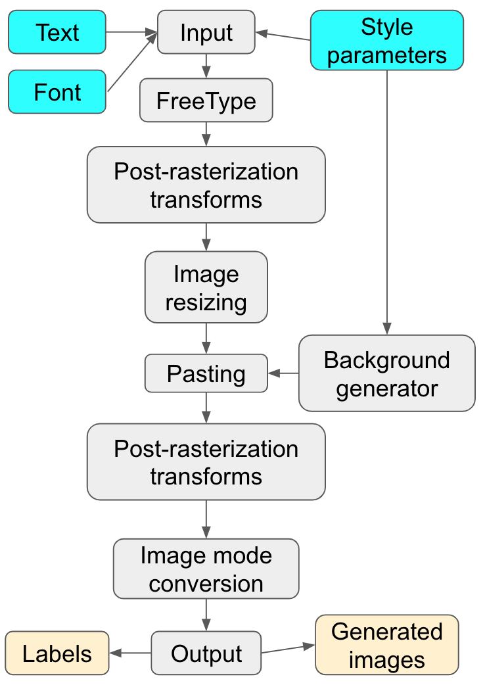

# OmniPrint 

This is the **user manual** of the data synthesizer OmniPrint.

Please carefull follow this user manual step by step in order to be able to synthesize datasets.


## Platform

- Linux or macOS
- Windows not tested, but should also work 
- Python >= 3.6.1


## Installation

##### Python virtual environment

- You can install this project within a Python virtual environment (instead of installing it in the default environment).

```zsh
virtualenv venv_omniprint 
source venv_omniprint/bin/activate
```

- Install requirements

```zsh
pip3 install --upgrade pip 
pip3 install -r requirements.txt
```

If `pip install` from `requirements.txt` fails, please consider installing the failed dependencies manually.

##### Docker

An alternative way is to use docker. If you wish to use docker, please first `cd` to `docker`. 

Then build docker image from Dockerfile by running the following command:

```zsh
docker build -t sunhaozhe/omniprint:1.0 .
```

Or you can also choose to pull the docker image from DockerHub:

```zsh
docker pull sunhaozhe/omniprint:1.0
```

When the docker image is ready, run the following two commands to create a docker container and enter it:

```zsh
docker run -dit --name omniprint_env -v [path-to-OmniPrint_for_review]/OmniPrint_for_review/OmniPrint:/workspace/OmniPrint sunhaozhe/omniprint:1.0

docker exec -it [CONTAINER_ID] bash
```

* The first command creates a docker container and uses `-v` to bind a volume: map host's directory `[path-to-OmniPrint_for_review]/OmniPrint_for_review/OmniPrint` to docker container's directory `/workspace/OmniPrint`. In this way, you can run all the data synthesis experiments within the bound directory (`/workspace/OmniPrint/omniprint`).


## Getting Started

##### Font preparation

The default installation provide 257 fonts (`omniprint/fonts/`) which are under the SIL Open Font License, Version 1.1. To get the full set of fonts, please run the font preparation program (under the directory `omniprint/prepare_fonts/`). By running the font preparation program, the directory `omniprint/prepare_fonts/fonts/` will be generated, please manually move/copy it to its parent directory `omniprint/fonts/`. The font preparation program not only downloads the font files, it also generates some metadata which is necessary for data synthesis. Please check [omniprint/prepare_fonts/README.md](omniprint/prepare_fonts/README.md) for more details. Fonts are usually protected under their own licenses. Some fonts cannot be redistributed or modified, which is the reason why we do not redistribute the full set of fonts with the code. On the other hand, the end users are free to collect their own set of fonts depending on their needs. They can collect a list of URLs and run the font preparation scripts in order to format fonts and collect metadata.


In order to get the full set of fonts, go to the main directory: 

```zsh
cd omniprint
```

Run the font preparation program:

```zsh
# go to the font preparation directory 
cd prepare_fonts

# The font preparation program 
## On linux/MacOS system, the following two lines 
## can be replaced by bash ./pipeline.sh
python3 download_fonts.py
python3 build_font_directory.py -d ../alphabets/fine 

# move omniprint/prepare_fonts/fonts/ to omniprint/fonts/
mv fonts ../fonts

# go back to the main directory (omniprint/)
cd ../
```

Once the font preparation scripts finish successfully, **please do not forget to manually move** the resulted folder `omniprint/prepare_fonts/fonts` to `omniprint/fonts` (run the command line `mv fonts ../fonts` in the folder `omniprint/prepare_fonts/`)

##### Hello world data synthesis

Now you can synthesize your first dataset (hello world) by running:

```zsh
python3 quick_run.py
```


Then you can customize the synthesis options by editing the class `Parameters` in `quick_run.py` to set up different command line options, then run again:

```zsh
python3 quick_run.py  
```

The entry point of **OmniPrint** is the script `omniprint/run.py`, the minimal example would be `python3 run.py --dict alphabets/fine/basic_latin_lowercase`.
* If you encounter errors like `run.py: error: unrecognized arguments: --dict alphabets/fine/basic_latin_lowercase`, please note that this is due to the copy-paste operation (invisible symbols), please manually type `python3 run.py --dict alphabets/fine/basic_latin_lowercase` in the command line to test the minimal example.
* A lot of options can be passed to `run.py` (see `python3 run.py --help`). 
* In order to avoid the overhead of writing these options in the terminal every time, we provide a helper script called `omniprint/quick_run.py`. Users can edit all the options in `omniprint/quick_run.py`, then simply run `python3 quick_run.py` in the terminal.

##### Examples of command lines for data synthesis

Alternatively, you can also specify the command line options directly in the terminal using command lines. Here are some examples (please consider running them to see the effects): 

```zsh
# generate 10 images using default options
python3 run.py --dict alphabets/fine/basic_latin_lowercase --count 10

# generate 1000 images with height 64
python3 run.py --dict alphabets/fine/basic_latin_lowercase --count 1000 --size 64

# generate 1000 images with height and width 32
python3 run.py --dict alphabets/fine/basic_latin_lowercase --count 1000 --size 32 --ensure_square_layout

# generate 1000 images with height and width 32, 
# all characters are rotated by 5.4 degrees clockwise. 
python3 run.py --dict alphabets/fine/basic_latin_lowercase --count 1000 --size 32 --ensure_square_layout --rotation -5.4

# generate 1000 images with height and width 32, 
# characters are randomly rotated within [-30, 30] degrees. 
python3 run.py --dict alphabets/fine/basic_latin_lowercase --count 1000 --size 32 --ensure_square_layout --rotation -30 30

# generate 1000 images with height and width 32, 
# characters are randomly rotated within [-30, 30] degrees, 
# they are also randomly sheared within [-0.5, 0.5].
python3 run.py --dict alphabets/fine/basic_latin_lowercase --count 1000 --size 32 --ensure_square_layout --rotation -30 30 --shear_x -0.5 0.5 

# generate 10 images with height and width 32, 
# each character is centered with added margins, 
# the added margins are 10% of the height/width 
# for top, left, bottom and right. 
python3 run.py --dict alphabets/fine/basic_latin_lowercase --count 10 --size 32 --ensure_square_layout --margins 0.1,0.1,0.1,0.1

# generate 10 images with height and width 32, 
# the character roughly occupies 64% of the space 
# in the image. The position of the character is 
# random within the image while ensuring the 
# character remains complete (random translation 
# in both directions). 
python3 run.py --dict alphabets/fine/basic_latin_lowercase --count 10 --size 32 --ensure_square_layout --margins 0.1,0.1,0.1,0.1 --random_translation_x --random_translation_y 

# generate grayscale images
python3 run.py --dict alphabets/fine/basic_latin_lowercase --count 10 --size 32 --ensure_square_layout --image_mode L 

# generate binary images
python3 run.py --dict alphabets/fine/basic_latin_lowercase --count 10 --size 32 --ensure_square_layout --image_mode 1

# text is filled with red color (foreground) 
python3 run.py --dict alphabets/fine/basic_latin_lowercase --count 10 --size 32 --ensure_square_layout --stroke_fill 255,0,0

# text is filled with a random RGB color (foreground)
python3 run.py --dict alphabets/fine/basic_latin_lowercase --count 10 --size 32 --ensure_square_layout --random_stroke_fill

# text with random Gaussian blurring 
# (after resizing/downsampling)
python3 run.py --dict alphabets/fine/basic_latin_lowercase --count 10 --size 32 --ensure_square_layout --blur 1 2 

# text with random color background 
python3 run.py --dict alphabets/fine/basic_latin_lowercase --count 10 --size 32 --ensure_square_layout --background random_plain_color

# text with plain white background 
python3 run.py --dict alphabets/fine/basic_latin_lowercase --count 10 --size 32 --ensure_square_layout --background plain_white

# text with image background, the background is 
# randomly cropped from some external images 
python3 run.py --dict alphabets/fine/basic_latin_lowercase --count 10 --size 32 --ensure_square_layout --background image

# text in other scripts/languages
python3 run.py --count 10 --size 32 --ensure_square_layout --dict alphabets/fine/chinese_group1 

python3 run.py --count 10 --size 32 --ensure_square_layout --dict alphabets/fine/hebrew

python3 run.py --count 10 --size 32 --ensure_square_layout --dict alphabets/fine/khmer_consonants

python3 run.py --count 10 --size 32 --ensure_square_layout --dict alphabets/fine/mongolian_digits 

# variable font weight (stroke width). 
## Make sure that the used fonts all support 
## customizable font weight. Font index files 
## with names variable_weight_* contain this 
## kind of fonts. 
python3 run.py --count 10 --size 32 --ensure_square_layout --dict alphabets/fine/basic_latin_uppercase --font_index fonts/variable_weight_basic_latin_uppercase --font_weight 400 500

# morphological image processing - erosion
## with kernel size 3, number of iterations 2 and 
## elliptical kernel, some margins are required for 
## morphological image processing 
python3 run.py --dict alphabets/fine/basic_latin_lowercase --count 10 --size 32 --ensure_square_layout --morph_erosion 3,2,ellipse --margins 0.08,0.08,0.08,0.08

# fill foreground with natural image/texture
python3 run.py --dict alphabets/fine/basic_latin_lowercase --count 10 --size 32 --ensure_square_layout --foreground_image

# create text outline and fill it with random color
python3 run.py --dict alphabets/fine/basic_latin_lowercase --count 10 --size 32 --ensure_square_layout --outline random_color

# create text outline and fill it with natural image/texture
python3 run.py --dict alphabets/fine/basic_latin_lowercase --count 10 --size 32 --ensure_square_layout --outline image

# create text outline (of width 8) and fill it with natural image/texture
python3 run.py --dict alphabets/fine/basic_latin_lowercase --count 10 --size 32 --ensure_square_layout --outline image --outline_size 8

# create hollow text (text with only outline), 
# some margins are required for morphological image processing
python3 run.py --dict alphabets/fine/basic_latin_lowercase --count 10 --size 32 --ensure_square_layout --morph_gradient 5,ellipse --margins 0.08,0.08,0.08,0.08

# create hollow text (text with only outline), 
# create text outline and fill it with random color. 
# Some margins are required for morphological image processing
python3 run.py --dict alphabets/fine/basic_latin_lowercase --count 10 --size 32 --ensure_square_layout --morph_gradient 5,ellipse --outline random_color --margins 0.08,0.08,0.08,0.08

# randomly apply perspective transformations to the image.
# It is recommended to add some margins, but this is not 
# required because sometimes one would accept the fact 
# that text can fall out of the image boundary.
python3 run.py --dict alphabets/fine/basic_latin_lowercase --count 10 --size 32 --ensure_square_layout --random_perspective_transform 0.08 --margins 0.08,0.08,0.08,0.08 

# fill the foreground text with random color
python3 run.py --dict alphabets/fine/basic_latin_lowercase --count 10 --size 32 --ensure_square_layout --random_stroke_fill

# fill the background with natural image/texture, then randomly apply brightness variation, contrast variation, color enhancement within the given range
python3 run.py --dict alphabets/fine/basic_latin_lowercase --count 10 --size 32 --ensure_square_layout --background image --brightness 0.5 2.0 --contrast 0.5 2.0 --color_enhance 0.5 2.0

# apply Gaussian blur (low-pass filter) before downsampling, this is useful for synthesizing small images
python3 run.py --dict alphabets/fine/basic_latin_lowercase --count 10 --size 28 --ensure_square_layout --gaussian_prior_resizing 2

# synthesize white-on-black images
python3 run.py --dict alphabets/fine/basic_latin_lowercase --count 10 --size 28 --ensure_square_layout --stroke_fill 255,255,255 --background 0,0,0

# apply pre-rasterization elastic transformation (with "strength" 0.04)
python3 run.py --dict alphabets/fine/basic_latin_lowercase --count 10 --size 28 --ensure_square_layout --pre_elastic 0.04

# apply post-rasterization elastic transformation (with "strength" 5)
python3 run.py --dict alphabets/fine/basic_latin_lowercase --count 10 --size 28 --ensure_square_layout --post_elastic 5

# apply both pre-rasterization elastic transformation and post-rasterization elastic transformation
python3 run.py --dict alphabets/fine/basic_latin_lowercase --count 10 --size 28 --ensure_square_layout --pre_elastic 0.04 --post_elastic 5

# stretch the ascender of characters (by 4000 font units)
python3 run.py --dict alphabets/fine/basic_latin_lowercase --count 10 --size 28 --ensure_square_layout --stretch_ascender 4000

# squeeze the ascender of characters (by 1000 font units)
python3 run.py --dict alphabets/fine/basic_latin_lowercase --count 10 --size 28 --ensure_square_layout --stretch_ascender -1000

# fill both foreground and background with natural image/texture
python3 run.py --dict alphabets/fine/basic_latin_lowercase --count 10 --size 32 --ensure_square_layout --foreground_image --background image

# fill both foreground and background with natural image/texture, using Poisson Image Editing to seamlessly blend foreground into background
python3 run.py --dict alphabets/fine/basic_latin_lowercase --count 10 --size 32 --ensure_square_layout --foreground_image --background image --image_blending_method poisson
```

To understand the command line options: 

```zsh
python3 run.py --help
```

```
usage: run.py [-h] [--output_dir [OUTPUT_DIR]] [-c [COUNT]] [-eqchr] [-s [SIZE]] [-p [NB_PROCESSES]] [-e [EXTENSION]] [--output_subdir OUTPUT_SUBDIR] [-bl BLUR [BLUR ...]] [-b BACKGROUND]
              [-blend IMAGE_BLENDING_METHOD] [-om] [-m [MARGINS]] [-ft [FONT]] [-fd [FONT_DIR]] [-fidx [FONT_INDEX]] [-id [IMAGE_DIR]] [-fgdid [FOREGROUND_IMAGE_DIR]] [-otlnid [OUTLINE_IMAGE_DIR]]
              [-otln OUTLINE] [-otlnsz OUTLINE_SIZE] [-dt [DICT]] [-txtf [TEXTFILE]] [-fwt FONT_WEIGHT [FONT_WEIGHT ...]] [-stf STROKE_FILL] [-rstf] [-fgdimg] [-im [IMAGE_MODE]] [-rsd RANDOM_SEED] [-esl]
              [-fsz FONT_SIZE] [-lt [LINEAR_TRANSFORM]] [-rtn ROTATION [ROTATION ...]] [-shrx SHEAR_X [SHEAR_X ...]] [-shry SHEAR_Y [SHEAR_Y ...]] [-sclx SCALE_X [SCALE_X ...]]
              [-scly SCALE_Y [SCALE_Y ...]] [-alpha ALPHA [ALPHA ...]] [-beta BETA [BETA ...]] [-gamma GAMMA [GAMMA ...]] [-delta DELTA [DELTA ...]] [-rtslnx] [-rtslny] [-pt [PERSPECTIVE_TRANSFORM]]
              [-rpt [RANDOM_PERSPECTIVE_TRANSFORM]] [-preelas PRE_ELASTIC] [-postelas POST_ELASTIC] [-ascender STRETCH_ASCENDER] [-descender STRETCH_DESCENDER] [-gpr GAUSSIAN_PRIOR_RESIZING]
              [-morphero MORPH_EROSION] [-rmorphero] [-morphdil MORPH_DILATION] [-rmorphdil] [-morphope MORPH_OPENING] [-rmorphope] [-morphclo MORPH_CLOSING] [-rmorphclo] [-morphgra MORPH_GRADIENT]
              [-rmorphgra] [-morphtoph MORPH_TOPHAT] [-rmorphtoph] [-morphblah MORPH_BLACKHAT] [-rmorphblah] [-brtn BRIGHTNESS [BRIGHTNESS ...]] [-ctrst CONTRAST [CONTRAST ...]]
              [-clrenhc COLOR_ENHANCE [COLOR_ENHANCE ...]] [-shrpns SHARPNESS [SHARPNESS ...]] [-silt]

Generate synthetic text data for text recognition.

optional arguments:
  -h, --help            show this help message and exit
  --output_dir [OUTPUT_DIR]
                        The output directory
  -c [COUNT], --count [COUNT]
                        The total number of images to be created. In this situation, the number of images for each character can differ. The semantic of this argument can be modified by the argument
                        --equal_char is enabled.
  -eqchr, --equal_char  If enabled, the argument --count will be considered as the number of images for each character, rather than the total number of images to be created. In this situation, the total
                        number of images to be created will be the number of characters of this alphabet multiplied by the number of the value of the argument --count.
  -s [SIZE], --size [SIZE]
                        Define the height of the produced images. If the option --ensure_square_layout is activated, then this will also be the width of the produced images, otherwise the width will be
                        determined by both the length of the text and the height.
  -p [NB_PROCESSES], --nb_processes [NB_PROCESSES]
                        Define the number of processes to use for image generation. If not provided, this equals to the number of CPU cores
  -e [EXTENSION], --extension [EXTENSION]
                        Define the extension to save the image with
  --output_subdir OUTPUT_SUBDIR
                        The output subdirectory. This option is reserved for multilingual/meta-learning dataset generation. In general, it is not recommended to manually set this option as the user.
  -bl BLUR [BLUR ...], --blur BLUR [BLUR ...]
                        Apply gaussian blur to the resulting sample. Should be an integer defining the blur radius, 0 by default. If this argument receives two space-seperated integers, a random value will
                        be used, the first value will be the lower bound, the second value will be the upper bound.
  -b BACKGROUND, --background BACKGROUND
                        Define what background to use. Possible values include: plain_white, random_plain_color, image, random_color_composition, gaussian_noise, quasicrystal or 3 comma-separated integers
                        representing a RGB color.
  -blend IMAGE_BLENDING_METHOD, --image_blending_method IMAGE_BLENDING_METHOD
                        How to blend foreground text with background. Current implementation includes trivial and poisson.
  -om, --output_mask    Define if the generator will return masks for the text
  -m [MARGINS], --margins [MARGINS]
                        Define the margins (percentage) around the text when rendered. Each element (top, left, bottom and right) should be a float
  -ft [FONT], --font [FONT]
                        Define font to be used
  -fd [FONT_DIR], --font_dir [FONT_DIR]
                        Define a font directory to be used
  -fidx [FONT_INDEX], --font_index [FONT_INDEX]
                        Define the font index file to be used, an example is fonts/latin.txt
  -id [IMAGE_DIR], --image_dir [IMAGE_DIR]
                        Define an image directory to use when background is set to image or the option foreground_image is set.
  -fgdid [FOREGROUND_IMAGE_DIR], --foreground_image_dir [FOREGROUND_IMAGE_DIR]
                        Define an image directory to use when the option foreground_image is set.
  -otlnid [OUTLINE_IMAGE_DIR], --outline_image_dir [OUTLINE_IMAGE_DIR]
                        Define an image directory to use if text outline exists and needs to be filled by natural image/texture.
  -otln OUTLINE, --outline OUTLINE
                        If this option is used, text will have outline effect. The possible values include: "image", "random_color" or 3 comma-separated integers representing a RGB color.
  -otlnsz OUTLINE_SIZE, --outline_size OUTLINE_SIZE
                        The size of text outline.
  -dt [DICT], --dict [DICT]
                        Define the dictionary to be used. Example: --dict alphabets/fine/basic_latin_lowercase
  -txtf [TEXTFILE], --textfile [TEXTFILE]
                        Define the text file to be used, each line of this text file will be used following the order. This option is used when the option --dict is not set.
  -fwt FONT_WEIGHT [FONT_WEIGHT ...], --font_weight FONT_WEIGHT [FONT_WEIGHT ...]
                        Define the stroke width (font weight). If two space-seperated float are presented, then a random value will be used. The first value will be the lower bound, the second value will
                        be the upper bound.
  -stf STROKE_FILL, --stroke_fill STROKE_FILL
                        Define the color of the strokes
  -rstf, --random_stroke_fill
                        Use random color to fill strokes.
  -fgdimg, --foreground_image
                        When set, use random crop of images to fill foreground text, the options random_stroke_fill and stroke_fill will be ignored if this option is set. The images to crop are from the
                        value of the option foreground_image_dir.
  -im [IMAGE_MODE], --image_mode [IMAGE_MODE]
                        Define the image mode to be used. RGB is default, L means 8-bit grayscale images, 1 means 1-bit binary images stored with one pixel per byte, etc.
  -rsd RANDOM_SEED, --random_seed RANDOM_SEED
                        Random seed
  -esl, --ensure_square_layout
                        Whether the width should be the same as the height
  -fsz FONT_SIZE, --font_size FONT_SIZE
                        Font size in point
  -lt [LINEAR_TRANSFORM], --linear_transform [LINEAR_TRANSFORM]
                        The parameter for linear transform. The length must be 4, 5 or 9. Length 4 corresponds low level parameterization, which means a, b, d, e, this is the most customizable
                        parameterization. Length 5 and length 9 correspond to high level parameterization. Length 5 means rotation, shear_x, shear_y, scale_x, scale_y. Length 9 means rotation, shear_x,
                        shear_y, scale_x, scale_y, alpha_, beta_, gamma_, delta_. If this parameter is set, other linear transform parameters like rotation, shear_x, etc. will be ignored
  -rtn ROTATION [ROTATION ...], --rotation ROTATION [ROTATION ...]
                        Define rotation angle (in degree) of the generated text. Used only when --linear_transform is not set. When two space-separated float are present, a random value will be used. The
                        first value will be used as the lower bound, the second value will be used as the upper bound.
  -shrx SHEAR_X [SHEAR_X ...], --shear_x SHEAR_X [SHEAR_X ...]
                        High level linear transform parameter, horizontal shear. Used only when --linear_transform is not set. When two space-separated float are present, a random value will be used. The
                        first value will be used as the lower bound, the second value will be used as the upper bound.
  -shry SHEAR_Y [SHEAR_Y ...], --shear_y SHEAR_Y [SHEAR_Y ...]
                        High level linear transform parameter, vertical shear. Used only when --linear_transform is not set. When two space-separated float are present, a random value will be used. The
                        first value will be used as the lower bound, the second value will be used as the upper bound.
  -sclx SCALE_X [SCALE_X ...], --scale_x SCALE_X [SCALE_X ...]
                        High level linear transform parameter, horizontal scale. Used only when --linear_transform is not set. When two space-separated float are present, a random value will be used. The
                        first value will be used as the lower bound, the second value will be used as the upper bound.
  -scly SCALE_Y [SCALE_Y ...], --scale_y SCALE_Y [SCALE_Y ...]
                        High level linear transform parameter, vertical scale. Used only when --linear_transform is not set. horizontal scale. Used only when --linear_transform is not set. When two space-
                        separated float are present, a random value will be used. The first value will be used as the lower bound, the second value will be used as the upper bound.
  -alpha ALPHA [ALPHA ...], --alpha ALPHA [ALPHA ...]
                        Customizable high level linear transform parameter, top left element in the 2x2 matrix. Used only when --linear_transform is not set. When two space-separated float are present, a
                        random value will be used. The first value will be used as the lower bound, the second value will be used as the upper bound.
  -beta BETA [BETA ...], --beta BETA [BETA ...]
                        Customizable high level linear transform parameter, top right element in the 2x2 matrix. Used only when --linear_transform is not set. When two space-separated float are present, a
                        random value will be used. The first value will be used as the lower bound, the second value will be used as the upper bound.
  -gamma GAMMA [GAMMA ...], --gamma GAMMA [GAMMA ...]
                        Customizable high level linear transform parameter, bottom left element in the 2x2 matrix. Used only when --linear_transform is not set. When two space-separated float are present,
                        a random value will be used. The first value will be used as the lower bound, the second value will be used as the upper bound.
  -delta DELTA [DELTA ...], --delta DELTA [DELTA ...]
                        Customizable high level linear transform parameter, bottom right element in the 2x2 matrix. Used only when --linear_transform is not set. When two space-separated float are present,
                        a random value will be used. The first value will be used as the lower bound, the second value will be used as the upper bound.
  -rtslnx, --random_translation_x
                        Uniformly sample the value of horizontal translation. This will have no effect if horizontal margins are 0
  -rtslny, --random_translation_y
                        Uniformly sample the value of vertical translation. This will have no effect if vertical margins are 0
  -pt [PERSPECTIVE_TRANSFORM], --perspective_transform [PERSPECTIVE_TRANSFORM]
                        Apply a perspective transformation. Given the coordinates of the four corners of the first quadrilateral and the coordinates of the four corners of the second quadrilateral,
                        quadrilateral onto the appropriate position on the second quadrilateral. Perspective transformation simulates different angle of view. Enter 8 real numbers (float) which correspond
                        to the 4 corner points (2D coordinates) of the target quadrilateral, these 4 corner points which be respectively mapped to [[0, 0], [1, 0], [0, 1], [1, 1]] in the source
                        quadrilateral. [0, 0] is the top left corner, [1, 0] is the top left corner, [0, 1] is the bottom left corner, [1, 1] is the bottom right corner. These coordinates have been
                        normalized to unit square [0, 1]^2. Thus, the entered corner points should match the order of magnitude and must be convex. For example, 0,0,1,0,0,1,1,1 will produce identity
                        transform. This option will have no effect if --random_perspective_transform is set. It is recommended to use appropriate value of the option --margins, otherwise part of
                        transformed text may fall out of the image boundary, which can lead to incomplete text.
  -rpt [RANDOM_PERSPECTIVE_TRANSFORM], --random_perspective_transform [RANDOM_PERSPECTIVE_TRANSFORM]
                        Randomly use a perspective transformation. Randomly generate a convex quadrilateral which will be mapped to the normalized unit square, the value of each axis is independently
                        sampled from the gaussian distribution, the standard deviation of the gaussian distribution is given by --random_perspective_transform. If this option is present but not followed by
                        a command-line argument, the standard deviation 0.05 will be used by default. It is recommended to use appropriate value of the option --margins, otherwise part of transformed text
                        may fall out of the image boundary, which can lead to incomplete text.
  -preelas PRE_ELASTIC, --pre_elastic PRE_ELASTIC
                        Pre-rasterization elastic transformation, also known as random vibration of individual anchor points. Value should be float in the range [0, 1). The actual elastic variation range
                        depends on the product of the range of original anchor points and the value of pre_elastic. If this value is too high, the visual effect may not be good. It is recommended that
                        pre_elastic <= 0.04. pre_elastic=0.1 can already lead to unrecognizable text.
  -postelas POST_ELASTIC, --post_elastic POST_ELASTIC
                        Post-rasterization elastic transformation. Define the parameter sigma of elastic transformation, it needs to be a real positive scalar. If the image size is 128x128, 5 will be a
                        good choice for this parameter, which leads to a water-like effect.
  -ascender STRETCH_ASCENDER, --stretch_ascender STRETCH_ASCENDER
                        Elongate (positive value) or contract (negative value) the ascender part of the text (the corresponding anchor points). The value should be integer. The effect of hundreds is
                        sometimes invisible.
  -descender STRETCH_DESCENDER, --stretch_descender STRETCH_DESCENDER
                        Elongate (positive value) or contract (negative value) the descender part of the text (the corresponding anchor points). The value should be integer. The effect of hundreds is
                        sometimes invisible.
  -gpr GAUSSIAN_PRIOR_RESIZING, --gaussian_prior_resizing GAUSSIAN_PRIOR_RESIZING
                        If not None, apply Gaussian filter to smooth image prior to resizing, the argument of this parameter needs to be a float, which will be used as the standard deviation of Gaussian
                        filter. Default is None, which means Gaussian filter is not used before resizing.
  -morphero MORPH_EROSION, --morph_erosion MORPH_EROSION
                        Morphological image processing - erosion. The argument must be a tuple separated by comma without space, the first element is the kernel size, the second element is the number of
                        iterations. For example, 3,2 means kernel_size=3x3, iterations=2. 3,2,ellipse (3,2,cross) means using elliptical (cross-shaped) kernel respectively. If the third argument is not
                        given, the default kernel shape will be rectangle. Please be aware that morphological image processing methods can generate unwelcome artifacts if text is close to the image
                        boundary, please always consider adding margins. If --random_translation_x or --random_translation_y moves the text near the boundary, there will be artifacts.
  -rmorphero, --random_morph_erosion
                        Uniformly sample the value of morphological erosion, the parameter --morph_erosion needs to be set. The range is [1, kernel_size] ([1, iterations]) kernel_shape is randomly chosen
                        among [rectangle, ellipse, cross].
  -morphdil MORPH_DILATION, --morph_dilation MORPH_DILATION
                        Morphological image processing - dilation. The argument must be a tuple separated by comma without space, the first element is the kernel size, the second element is the number of
                        iterations. For example, 3,2 means kernel_size=3x3, iterations=2. 3,2,ellipse (3,2,cross) means using elliptical (cross-shaped) kernel respectively. If the third argument is not
                        given, the default kernel shape will be rectangle. Please be aware that morphological image processing methods can generate unwelcome artifacts if text is close to the image
                        boundary, please always consider adding margins. If --random_translation_x or --random_translation_y moves the text near the boundary, there will be artifacts.
  -rmorphdil, --random_morph_dilation
                        Uniformly sample the value of morphological dilation, the parameter --morph_dilation needs to be set. The range is [1, kernel_size] ([1, iterations]) kernel_shape is randomly chosen
                        among [rectangle, ellipse, cross].
  -morphope MORPH_OPENING, --morph_opening MORPH_OPENING
                        Morphological image processing - opening. The argument must be a tuple separated by comma without space, the first element is the kernel size, the second element is the kernel
                        shape. For example, 3 means kernel_size=3x3. 3,ellipse (3,cross) means using elliptical (cross-shaped) kernel respectively. If the second argument is not given, the default kernel
                        shape will be rectangle. Please be aware that morphological image processing methods can generate unwelcome artifacts if text is close to the image boundary, please always consider
                        adding margins. If --random_translation_x or --random_translation_y moves the text near the boundary, there will be artifacts.
  -rmorphope, --random_morph_opening
                        Uniformly sample the value of morphological opening, the parameter --morph_opening needs to be set. The range is [1, kernel_size] kernel_shape is randomly chosen among [rectangle,
                        ellipse, cross].
  -morphclo MORPH_CLOSING, --morph_closing MORPH_CLOSING
                        Morphological image processing - closing. The argument must be a tuple separated by comma without space, the first element is the kernel size, the second element is the kernel
                        shape. For example, 3 means kernel_size=3x3. 3,ellipse (3,cross) means using elliptical (cross-shaped) kernel respectively. If the second argument is not given, the default kernel
                        shape will be rectangle. Please be aware that morphological image processing methods can generate unwelcome artifacts if text is close to the image boundary, please always consider
                        adding margins. If --random_translation_x or --random_translation_y moves the text near the boundary, there will be artifacts.
  -rmorphclo, --random_morph_closing
                        Uniformly sample the value of morphological closing, the parameter --morph_closing needs to be set. The range is [1, kernel_size] kernel_shape is randomly chosen among [rectangle,
                        ellipse, cross].
  -morphgra MORPH_GRADIENT, --morph_gradient MORPH_GRADIENT
                        Morphological image processing - gradient. The argument must be a tuple separated by comma without space, the first element is the kernel size, the second element is the kernel
                        shape. For example, 3 means kernel_size=3x3. 3,ellipse (3,cross) means using elliptical (cross-shaped) kernel respectively. If the second argument is not given, the default kernel
                        shape will be rectangle. Please be aware that morphological image processing methods can generate unwelcome artifacts if text is close to the image boundary, please always consider
                        adding margins. If --random_translation_x or --random_translation_y moves the text near the boundary, there will be artifacts.
  -rmorphgra, --random_morph_gradient
                        Uniformly sample the value of morphological gradient, the parameter --morph_gradient needs to be set. The range is [1, kernel_size] kernel_shape is randomly chosen among [rectangle,
                        ellipse, cross].
  -morphtoph MORPH_TOPHAT, --morph_tophat MORPH_TOPHAT
                        Morphological image processing - Top Hat. The argument must be a tuple separated by comma without space, the first element is the kernel size, the second element is the kernel
                        shape. For example, 3 means kernel_size=3x3. 3,ellipse (3,cross) means using elliptical (cross-shaped) kernel respectively. If the second argument is not given, the default kernel
                        shape will be rectangle. Please be aware that morphological image processing methods can generate unwelcome artifacts if text is close to the image boundary, please always consider
                        adding margins. If --random_translation_x or --random_translation_y moves the text near the boundary, there will be artifacts.
  -rmorphtoph, --random_morph_tophat
                        Uniformly sample the value of morphological tophat, the parameter --morph_tophat needs to be set. The range is [1, kernel_size] kernel_shape is randomly chosen among [rectangle,
                        ellipse, cross].
  -morphblah MORPH_BLACKHAT, --morph_blackhat MORPH_BLACKHAT
                        Morphological image processing - Black Hat. The argument must be a tuple separated by comma without space, the first element is the kernel size, the second element is the kernel
                        shape. For example, 3 means kernel_size=3x3. 3,ellipse (3,cross) means using elliptical (cross-shaped) kernel respectively. If the second argument is not given, the default kernel
                        shape will be rectangle. Please be aware that morphological image processing methods can generate unwelcome artifacts if text is close to the image boundary, please always consider
                        adding margins. If --random_translation_x or --random_translation_y moves the text near the boundary, there will be artifacts.
  -rmorphblah, --random_morph_blackhat
                        Uniformly sample the value of morphological blackhat, the parameter --morph_blackhat needs to be set. The range is [1, kernel_size] kernel_shape is randomly chosen among [rectangle,
                        ellipse, cross].
  -brtn BRIGHTNESS [BRIGHTNESS ...], --brightness BRIGHTNESS [BRIGHTNESS ...]
                        Brightness enhancement. Needs to be a float. Values greater than 1 make the image brighter. Values less than 1 make the image darker. The value 0 makes the image completely black.
                        The value 1 leaves the image unchanged. If two space-separated float are present, then a random value will be used. The first value will be used as the lower bound, the second value
                        will be used as the upper bound.
  -ctrst CONTRAST [CONTRAST ...], --contrast CONTRAST [CONTRAST ...]
                        Contrast enhancement. Needs to be a float. Values greater than 1 increase brightness range, making bright color brigher, dark color darker. Values less than 1 push colors towards
                        gray. The value 0 makes the image completely gray. The value 1 leaves the image unchanged. If two space-separated float are present, then a random value will be used. The first
                        value will be used as the lower bound, the second value will be used as the upper bound.
  -clrenhc COLOR_ENHANCE [COLOR_ENHANCE ...], --color_enhance COLOR_ENHANCE [COLOR_ENHANCE ...]
                        Color enhancement. Needs to be a float. Values greater than 1 make the color stronger. The value 0 makes the image grayscale. The value 1 leaves the image unchanged. If two space-
                        separated float are present, then a random value will be used. The first value will be used as the lower bound, the second value will be used as the upper bound.
  -shrpns SHARPNESS [SHARPNESS ...], --sharpness SHARPNESS [SHARPNESS ...]
                        Sharpness enhancement. Needs to be a float. Values greater than 1 apply a sharpening filter to the image. Values less than 1 blur the image. The value 1 leaves the image unchanged.
                        If two space-separated float are present, then a random value will be used. The first value will be used as the lower bound, the second value will be used as the upper bound.
  -silt, --silent       If True, no verbose information will be printed during generation process.
```


## Software architecture




Step-by-step visualization of an example transformation pipeline: 


## Examples


### Example dataset 1


In this first example, every image is grayscale and contains a single character randomly selected from Hiragana script (Japanese). The size of each image is 32x32. Every character is rotated by a random degree uniformly sampled from the range [−30,30], composed by a random horizontal shear uniformly sampled from the range [−0.5, 0.5]. Each character occupies about 64% of the area of the image. The random translation option along both horizontal and vertical axes is activated, which means that each foreground text was pasted at a random position within its background image. We used plain whiteboard as the background for this dataset. The standard deviation of the Gaussian filter prior to downsampling is 2.

To reproduce this example using `omniprint/quick_run.py`:

- First edit `omniprint/quick_run.py` like this

```python
class Parameters:
    count = 1000
    size = 32 
    ensure_square_layout = True
    image_mode = "L" 
    margins = "0.1,0.1,0.1,0.1"
    background = "plain_white" 
    dict_ = "alphabets/fine/hiragana" 
    random_translation_x = True 
    random_translation_y = True 
    gaussian_prior_resizing = 2 
    rotation = "-30 30"
    shear_x = "-0.5 0.5"
```

- Then run `python3 quick_run.py` 

Equivalently, run:

```zsh
python3 run.py --count 1000 --size 32 --ensure_square_layout --image_mode L --margins 0.1,0.1,0.1,0.1 --background plain_white --dict alphabets/fine/hiragana --random_translation_x --random_translation_y --gaussian_prior_resizing 2 --rotation -30 30 --shear_x -0.5 0.5
```


### Example dataset 2


In the second example, characters are chosen from Russian alphabet. Each image is RGB and resized to 64x64. No margins are added. A random perspective transform is applied to each image (foreground text layer). The background is randomly cropped from some external images.

To reproduce this example using `omniprint/quick_run.py`:

- First edit `omniprint/quick_run.py` like this

```python
class Parameters:
    count = 1000
    size = 64 
    ensure_square_layout = True
    image_mode = "RGB" 
    background = "image" 
    dict_ = "alphabets/fine/russian" 
    random_perspective_transform = 0.05
    margins = "0.08,0.08,0.08,0.08"
```

- Then run `python3 quick_run.py` 

Equivalently, run:

```zsh
python3 run.py --count 1000 --size 64 --ensure_square_layout --image_mode RGB --background image --dict alphabets/fine/russian --random_perspective_transform 0.05 --margins 0.08,0.08,0.08,0.08
```


## Dataset formats 

### Raw dataset 

By default, the generated raw dataset will be stored under the directory `omniprint/out/`. For example, let's assume that `omniprint/out/20201222_223218_562501/` is one raw dataset generated by one run (`python3 quick_run.py`). The name `20201222_223218_562501` corresponds to the UTC date and time. `omniprint/out/20201222_223218_562501/` contains two subdirectories:

- `omniprint/out/20201222_223218_562501/data/`
- `omniprint/out/20201222_223218_562501/label/`

`omniprint/out/20201222_223218_562501/data/` contains images such as 

- `omniprint/out/20201222_223218_562501/data/20201222_223218_562501_0.png`
- `omniprint/out/20201222_223218_562501/data/20201222_223218_562501_1.png`
- `omniprint/out/20201222_223218_562501/data/20201222_223218_562501_2.png`
- etc. 

`omniprint/out/20201222_223218_562501/label/` contains one single file `raw_labels.csv`. This csv files contains all available labels, its column depends on the used command line options. For example, its column can include: 

- `image_name`
- `text`
- `unicode_code_point`
- `font_file`
- `font_weight`
- `image_height_resolution`
- `image_width_resolution`
- `margin_bottom`
- `rotation`
- `shear_x`
- `family_name` (font)
- `style_name` (font)
- `postscript_name` (font)
- etc. 


Although the raw datasets could be used directly by extracting desired labels from `omniprint/out/20201222_223218_562501/label/raw_labels.csv`, we provide utility programs which turn them into more standard dataset formats like [AutoML format](https://github.com/codalab/chalab/wiki/Help:-Wizard-%E2%80%90-Challenge-%E2%80%90-Data) and [AutoDL File format](https://github.com/zhengying-liu/autodl-contrib/tree/master/file_format). This utility programs are stored under the directory `omniprint/dataset/`. 


### Dataset in AutoML format or AutoDL File format

- [AutoML format](https://github.com/codalab/chalab/wiki/Help:-Wizard-%E2%80%90-Challenge-%E2%80%90-Data) is better for machine to use. Basically, AutoML format stores the whole dataset in the form of a single matrix. Each row of the matrix corresponds to one vectorized image. Consequently, if one wants to use AutoML format, one must ensure that each image is of the same size (at least the same number of pixels * channels). The raw dataset should normally be generated using the command line option `--ensure_square_layout`, otherwise the width of the images may differ. 
- [AutoDL File format](https://github.com/zhengying-liu/autodl-contrib/tree/master/file_format) is better for human to visualize. Basically, AutoDL File format stores the images as they are. This format is similar to the format of the raw datasets. 


First, go to the dataset formatting directory `omniprint/dataset/`:

```zsh
cd dataset
```

The entry point of the dataset formatting program is `omniprint/dataset/dataset_formatter.py`. 

To understand the available options, run:

```zsh
python3 dataset_formatter.py --help
```

```
usage: dataset_formatter.py [-h] [-n DATASET_NAME] [-r RAW_DATASET_PATH] [-l LABEL_NAME] [-ir] [-f FORMAT] [--is_multilingual]

optional arguments:
  -h, --help            show this help message and exit
  -n DATASET_NAME, --dataset_name DATASET_NAME
  -r RAW_DATASET_PATH, --raw_dataset_path RAW_DATASET_PATH
  -l LABEL_NAME, --label_name LABEL_NAME
  -ir, --is_regression
  -f FORMAT, --format FORMAT
                        Which data format to use? Options: automl, file.
  --is_multilingual
```


For example, if one wants to turn `omniprint/out/20201222_223218_562501/` into AutoML format and wants to make a multiclass classification dataset of characters/symbols, one can use the column `unicode_code_point` of `omniprint/out/20201222_223218_562501/label/raw_labels.csv`. Unicode code point is the unique ID of each character, each Unicode code point is an integer. 

```zsh
python3 dataset_formatter.py --dataset_name make_a_name_as_you_like --raw_dataset_path ../out/20201222_223218_562501 --label_name unicode_code_point --format automl
```

Instead of AutoML format, if one wants to make the same dataset in AutoDL File format.

```zsh
python3 dataset_formatter.py --dataset_name make_a_name_as_you_like --raw_dataset_path ../out/20201222_223218_562501 --label_name unicode_code_point --format file
```

If one wants to make a regression dataset from `omniprint/out/20201222_223218_562501/` in AutoML format and wants to predict the rotation of characters/symbols, one can use the column `rotation` (`float`) of `omniprint/out/20201222_223218_562501/label/raw_labels.csv`.

```zsh
# this command line requires that the rotation 
# transformation is used in the dataset 
# 20201222_223218_562501, otherwise it will raise 
# KeyError 'rotation'

python3 dataset_formatter.py --dataset_name make_a_name_as_you_like --raw_dataset_path ../out/20201222_223218_562501 --label_name rotation --format automl --is_regression
```

Of note is that AutoDL File format does not support regression task.

The formatted datasets (AutoML format or AutoDL File format) are stored under the directory `omniprint/dataset/datasets/`.


## Extensibility

**OmniPrint** is easily extensible. 

### Adding new languages/scripts/alphabets 

Importing new alphabets is easy in **OmniPrint**. For example, if one wants to add an alphabet called `esperanto`. 

- Create a text file called `esperanto.txt` under the directory `omniprint/alphabets/`
- In `omniprint/alphabets/esperanto.txt`, insert alphabet/character/symbol of this language/script, one item per line. This file should not contain empty lines. 
- Don't forget to make a font index file for this newly added alphabet, for example `omniprint/fonts/index/esperanto.txt`. Insert names (including suffix like `.ttf` or `.otf`) of the font files (among font files under `omniprint/fonts/fonts/`) that fully support `omniprint/alphabets/esperanto.txt`.
- Optionally, make `omniprint/fonts/index/variable_weight_esperanto.txt` to allow font weight (stroke width) variation.


### Adding new fonts

Importing new fonts is easy in **OmniPrint**. 

- Move new fonts to the directory `omniprint/fonts/fonts/`
- Optionally, update the index file under the directory `omniprint/fonts/index/` if users want to randomly select fonts
- Optionally, update the metadata of fonts under the directory `omniprint/fonts/metadata/`
- Users should not forget to include license files in the directory `omniprint/fonts/licenses/`

Please be aware that some fonts can produce false rendering without reporting warnings or errors, users import new fonts at their own risk. 

### Adding new post-rasterization transformations

New post-rasterization transformations can be easily added to the image generation pipeline. For example, if one wants to add a transformation called `my_transform`.

- Create a Python script called `my_transform.py` under the directory `omniprint/transforms/`
- Implement the desired functionalities in `omniprint/transforms/my_transform.py`, which contains a function called `transform`. The first two positional parameters of the function `transform` should be the image and its corresponding mask. (Used for masking foreground text layer such that only the text itself will be pasted onto the background.) The image is a RGB `PIL.Image.Image` object (The image will be converted to grayscale image or binary image in the end, if needed.) where text is black (`0`) and background is white (`255`). The mask is a grayscale `PIL.Image.Image` object where text is white (`255`) and background is black (`0`). In principle, the mask should undergo the same operations as the image while taking into account the difference in image mode and black/white convention. The function `transform` can, of course, accept other parameters, which is usually the case. The output of the function `transform` is a `tuple` of size 2: the first is the transformed image, the second is the transformed mask. 
- Edit the script `omniprint/transforms/__init__.py`, add one line: `from transforms.my_transform import transform as my_transform`
- Edit the script `omniprint/data_generator.py` to insert the implemented transform at appropriate location. For example, `img, mask = my_transform(img, mask)`
- It is recommended to edit the argument parsing function of the entry script `omniprint/run.py`, which allows specifying parameters of the newly implemented transformation via command line options. It is also recommended to wrap `img, mask = my_transform(img, mask)` in `omniprint/data_generator.py` by something like `if args.get(my_transform) is not None:`, which allows to activate and deactivate the newly implemented transformation.


## Speed benchmarks

Number of images generated per second.

Test command: 
```python
python3 run.py --count 1000 --size 32 --ensure_square_layout --image_mode L --dict alphabets/fine/basic_latin_lowercase
```

- 2.7 GHz Dual-Core Intel Core i5 + SSD 
    - `--nb_processes 1`   123 images per second 
    - `--nb_processes 2`   197 images per second
    - `--nb_processes 4`   226 images per second
    - `--nb_processes 8`   174 images per second
    - `--nb_processes 16` 130 images per second 
    - `--nb_processes 32` 94 images per second


## Issues

If you encounter any technical issues, please file a GitHub Issue. 


## Citation

[Paper](https://openreview.net/pdf?id=R07XwJPmgpl) | [Appendix](https://openreview.net/attachment?id=R07XwJPmgpl&name=supplementary_material)

```
@inproceedings{sun2021omniprint,
title={OmniPrint: A Configurable Printed Character Synthesizer},
author={Haozhe Sun and Wei-Wei Tu and Isabelle M Guyon},
booktitle={Thirty-fifth Conference on Neural Information Processing Systems Datasets and Benchmarks Track (Round 1)},
year={2021},
url={https://openreview.net/forum?id=R07XwJPmgpl}
}
```


## Disclaimer

This software is under MIT license.

This project was a fork of [TextRecognitionDataGenerator](https://github.com/Belval/TextRecognitionDataGenerator) (MIT license). We would like to warmly thank all the contributors of this open source software, especially Edouard Belval. 

